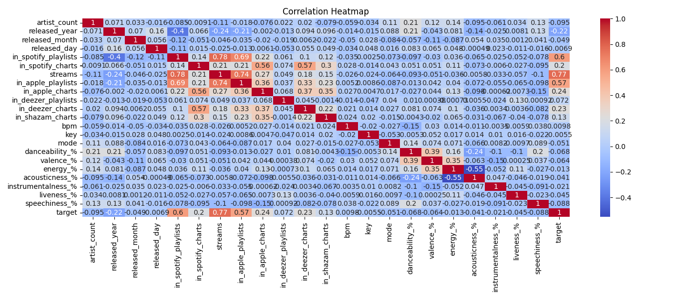
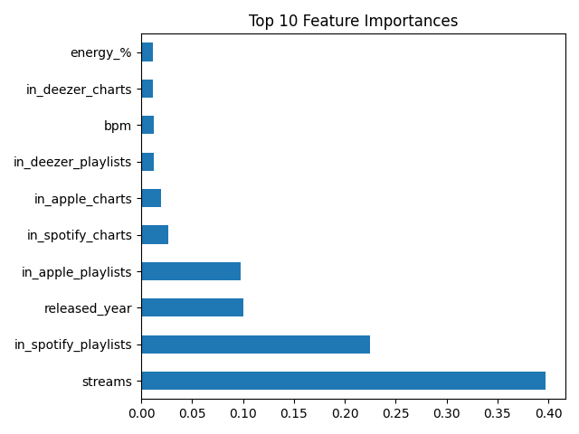
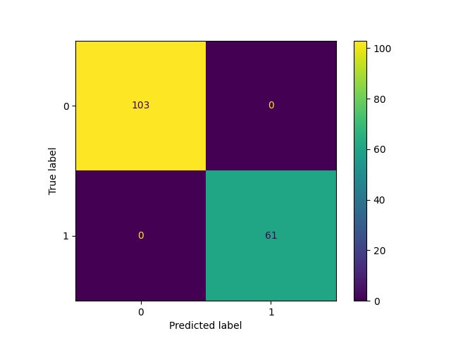

# 🎵 Spotify Song Popularity Prediction


> Predicting whether a song will be popular using machine learning and Spotify audio features. This project leverages data exploration, preprocessing, and modeling to build an accurate classification model.

---

## 📊 Overview

This notebook analyzes a dataset of Spotify tracks with features like acousticness, energy, tempo, and danceability to determine if a song is likely to be popular (stream count above average). It includes:

- 🔍 Data exploration and visualization
- 🧹 Data cleaning and normalization
- 🧠 Model training and evaluation (Random Forest, Logistic Regression, etc.)
- 🎯 Feature importance analysis

---

## 📁 Project Structure

```bash
spotify-song-prediction/
├── spotify-song-prediction.ipynb   # Main analysis notebook
├── feature_importance.png          # Feature importance visualization
├── heatmap.png                     # Correlation heatmap
├── confusion_matrix.png            # Confusion matrix plot
├── requirements.txt                # Python dependencies
└── README.md                       # Project documentation
```

---

🚀 Getting Started
1.Clone the repository

```bash
git clone https://github.com/Gouravarapu-SA/Spotify-song-prediction.git
cd Spotify-song-prediction
```
2.Install dependencies

```bash
pip install -r requirements.txt
```
3.Launch the notebook

```bash
jupyter notebook spotify-song-prediction.ipynb
```

---

## 📸 Visual Previews

<table>
  <tr>
    <td></td>
    <td></td>
  </tr>
  <tr>
    <td align="center">Correlation Heatmap</td>
    <td align="center">Top Predictive Features</td>
  </tr>
  <tr>
    <td colspan="2" align="center"></td>
  </tr>
  <tr>
    <td colspan="2" align="center">Model Confusion Matrix</td>
  </tr>
</table>

> Visualizations help uncover feature relationships and evaluate classification results.

---

## 🧪 Model Evaluation

- 📊 Accuracy Score  
- 📉 Confusion Matrix  
- 🔁 Cross Validation  
- 📃 Classification Report (Precision, Recall, F1)

---

## 🧹 Data Preprocessing Steps

- ✅ Handling Missing Values  
- ✅ Feature Selection and Scaling  
- ✅ Label Binarization for Popularity Classification  
- ✅ Dataset Splitting for Train/Test

---

## 📜 License

This project is licensed under the **MIT License**.  
Feel free to use, modify, and distribute it.

---

## 🙌 Acknowledgments

Thanks to the **Spotify API**, **Kaggle datasets**, and the **open-source Python community** for the tools and data.

---

## 📫 Contact

Have questions or feedback?  
📧 **akhilsai96@gmail.com**


